# Guide utilisateur — gouv-widgets

Ce guide presente les principaux parcours d'utilisation de **gouv-widgets**, une bibliotheque de Web Components de dataviz pour les sites gouvernementaux francais, conforme au DSFR.

Chaque parcours est presente comme une **user story** :

> **Pour** [objectif metier], **je dois** [etapes concretes], **afin de** [resultat d'integration].

---

## Vue d'ensemble de l'interface

L'application est accessible depuis la page d'accueil qui regroupe tous les outils :


Les outils disponibles sont :
- **Sources** : connecter et gerer les sources de donnees (Grist, API, manuelles)
- **Builder** : generateur visuel de graphiques pas-a-pas
- **Builder IA** : generateur de graphiques par conversation avec l'IA Albert
- **Playground** : editeur de code interactif avec apercu temps reel
- **Dashboard** : editeur visuel de tableaux de bord multi-widgets
- **Monitoring** : suivi des deployements de widgets en production

---

## Parcours A : Creer un graphique a partir de donnees locales

> **Pour** afficher un graphique en barres du PIB par region sur mon site,
> **je dois** creer une source de donnees manuelle dans Sources puis configurer le graphique dans le Builder,
> **afin d'** obtenir un code HTML copier-coller integrable dans n'importe quelle page web.

### Etape 1 — Ouvrir la page Sources

Naviguez vers **Sources** depuis le menu. La page affiche les connexions existantes (Grist, API) et les sources sauvegardees. Cliquez sur **"Creer une source manuelle"**.


### Etape 2 — Saisir les donnees

La modale de creation s'ouvre avec trois modes de saisie : **Tableau** (saisie directe), **JSON** (coller du JSON) ou **CSV** (importer un fichier).

1. Donnez un nom a la source (ex: "Statistiques regions")
2. Remplissez le tableau avec vos donnees
3. Cliquez sur **Sauvegarder**


### Etape 3 — Ouvrir le Builder et charger la source

Naviguez vers le **Builder**. Dans l'etape 1 "Source de donnees", selectionnez votre source dans la dropdown puis cliquez sur **Charger**. Les champs disponibles apparaissent dans les selecteurs.


### Etape 4 — Choisir le type de graphique

L'etape 2 propose une grille de 11 types de graphiques : barres, lignes, camembert, radar, carte, KPI, tableau, etc. Cliquez sur le type souhaite (ici **Barres**).


### Etape 5 — Configurer et generer

Completez la configuration :
- **Axe X** : le champ de categorie (ex: `region`)
- **Axe Y** : le champ numerique (ex: `PIB`)
- **Agregation** : moyenne, somme, comptage, min, max
- **Titre et sous-titre** dans l'onglet Apparence

Puis cliquez sur **Generer le graphique**.


### Etape 6 — Copier le code genere

Basculez sur l'onglet **Code genere** dans le panneau de droite. Le code HTML complet est affiche, pret a etre copie. Cliquez sur **Copier le code** pour l'integrer dans votre page.


Le code genere est autonome : il inclut les balises DSFR Chart (`<bar-chart>`, `<line-chart>`, etc.) avec les donnees en attributs, ainsi que les liens vers les CSS et JS necessaires.

---

## Parcours B : Creer un graphique dynamique depuis Grist

> **Pour** afficher un graphique alimente en temps reel par une table Grist,
> **je dois** connecter mon instance Grist dans Sources puis generer un graphique en mode dynamique dans le Builder,
> **afin d'** obtenir un widget HTML qui se met a jour automatiquement depuis Grist.

### Etape 1 — Creer une connexion Grist

Dans **Sources**, cliquez sur **Nouvelle connexion**. Selectionnez le type **Grist** et renseignez :

1. Le nom de la connexion
2. L'URL du serveur Grist (ex: `https://grist.numerique.gouv.fr`)
3. Cochez "Document public" si le document est partage publiquement, sinon entrez votre cle API

Cliquez sur **Tester et sauvegarder**.


### Etape 2 — Explorer les donnees Grist

Une fois connecte, cliquez sur la connexion dans la barre laterale. L'explorateur affiche les documents et tables disponibles. L'onglet **Apercu** permet de previsualiser les donnees.


### Etape 3 — Activer le mode dynamique dans le Builder

Dans le **Builder**, selectionnez la source Grist et chargez les champs. Une section supplementaire apparait : **Mode de generation**. Selectionnez **Chargement dynamique** pour que le code genere interroge Grist en temps reel.

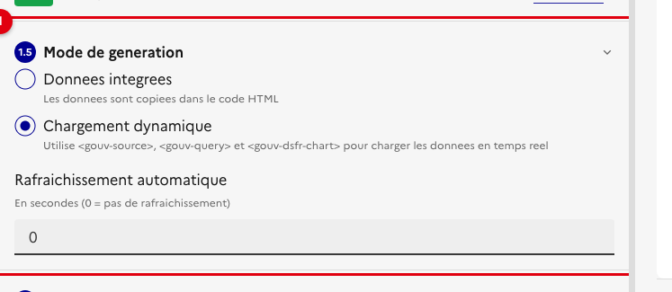

- **Donnees integrees** : les donnees sont copiees en dur dans le HTML (statique)
- **Chargement dynamique** : utilise `<gouv-source>` + `<gouv-query>` + `<gouv-dsfr-chart>` pour charger les donnees en temps reel

### Etape 4 — Code genere avec composants dynamiques

Apres avoir configure et genere le graphique, le code genere contient les Web Components gouv-widgets :


Le code genere ressemble a :
```html
<gouv-source id="data" url="https://grist.numerique.gouv.fr/api/docs/xxx/tables/yyy/records"
             transform="records[].fields"></gouv-source>
<gouv-query source="data" group-by="Pays" aggregate="PIB:avg" order-by="value:desc"></gouv-query>
<gouv-dsfr-chart source="query-result" type="bar" label-field="Pays" value-field="PIB"
                 title="PIB par pays"></gouv-dsfr-chart>
```

---

## Parcours C : Generer un graphique avec l'IA (Builder IA)

> **Pour** generer rapidement un graphique en decrivant ce que je veux en langage naturel,
> **je dois** selectionner une source de donnees puis discuter avec l'assistant Albert IA,
> **afin d'** obtenir un graphique et son code sans ecrire de configuration manuelle.

### Etape 1 — Charger une source et ouvrir le chat

Dans le **Builder IA**, selectionnez une source de donnees et cliquez sur **Charger**. L'interface se compose de deux zones :

1. Le panneau de configuration et le **chat IA** a gauche
2. Le panneau d'**apercu**, **code** et **donnees** a droite


### Etape 2 — Decrire le graphique souhaite

Ecrivez dans le chat ce que vous souhaitez, en langage naturel. Par exemple :

> "Fais-moi un graphique en barres des beneficiaires par region"

L'IA analyse les champs disponibles dans vos donnees et genere la configuration correspondante. Elle propose ensuite des **suggestions** pour affiner le resultat.


### Etape 3 — Iterer et exporter

L'IA repond avec :
- Le graphique genere dans l'**apercu**
- L'action executee (en JSON)
- Des **suggestions** pour modifier le graphique ("Passe en camembert", "Filtre sur IDF", etc.)

Vous pouvez continuer la conversation pour ajuster le graphique, puis copier le code depuis l'onglet **Code genere**.


> **Note** : le Builder IA utilise l'API Albert (IA souveraine de l'Etat). Un token API Albert est necessaire, configurable dans la section "Configuration Albert IA".

---

## Parcours D : Prototyper avec le Playground

> **Pour** tester et modifier du code de composants gouv-widgets en temps reel,
> **je dois** utiliser le Playground avec ses exemples precharges ou ecrire mon propre code,
> **afin de** prototyper rapidement des visualisations avant de les integrer.

### Etape 1 — Charger un exemple

Le **Playground** est un editeur de code split avec un apercu en temps reel. Un selecteur d'exemples propose des modeles classes en 3 categories :

- **Chart.js (API OpenDataSoft)** : graphiques avec appels API reels
- **DSFR Chart natifs** : composants DSFR (barres, lignes, camembert, jauge, radar, carte)
- **Composants gouv-widgets** : `gouv-source`, `gouv-kpi`, `gouv-datalist`, dashboard complet


### Etape 2 — Executer et visualiser

Selectionnez un exemple (ici "DSFR Bar Chart") et cliquez sur **Executer**. Le code a gauche est rendu en temps reel dans l'apercu a droite.


L'exemple ci-dessus charge les prix moyens du controle technique par region depuis l'API data.economie.gouv.fr et les affiche avec un composant `<bar-chart>` DSFR natif.

### Etape 3 — Modifier et sauvegarder

Modifiez le code dans l'editeur (theme Dracula), puis :
1. Cliquez sur **Executer** (ou `Ctrl+Entree`) pour voir le resultat
2. Cliquez sur **Copier** pour copier le code
3. Cliquez sur **Favoris** pour sauvegarder dans vos favoris


### Etape 4 — Tester les composants gouv-widgets

L'exemple "gouv-source + gouv-dsfr-chart" montre comment connecter une source de donnees a un graphique DSFR via les Web Components :

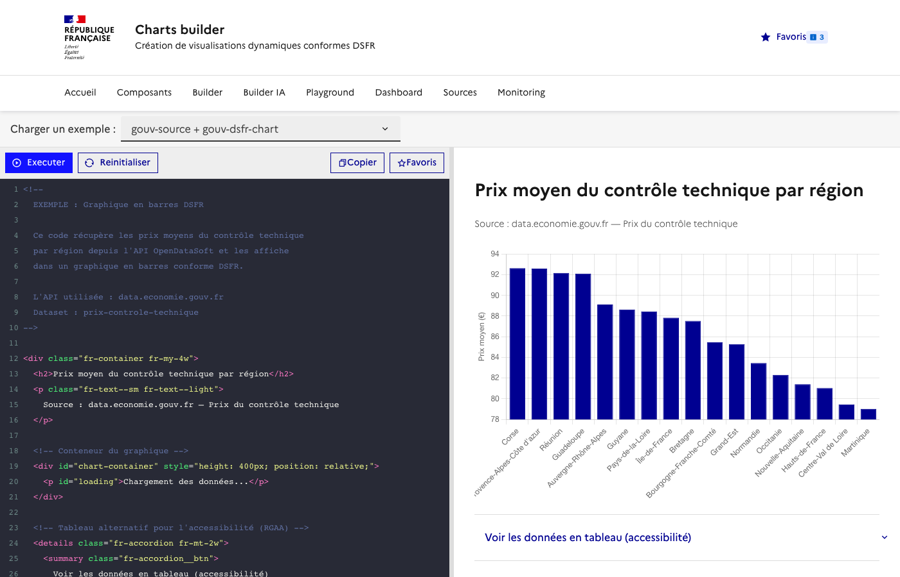

---

## Parcours E : Composer un tableau de bord

> **Pour** assembler plusieurs visualisations dans un tableau de bord,
> **je dois** utiliser l'editeur de Dashboard pour glisser-deposer des widgets et les configurer,
> **afin d'** obtenir une page de dashboard exportable en HTML.

### Etape 1 — Decouvrir l'editeur de dashboard

Le **Dashboard** est un editeur visuel avec :
- A gauche : la **bibliotheque de widgets** (KPI, Graphique, Tableau, Texte), les **favoris** sauvegardes, et les reglages de **grille**
- Au centre : la **grille de placement** avec des zones de depot

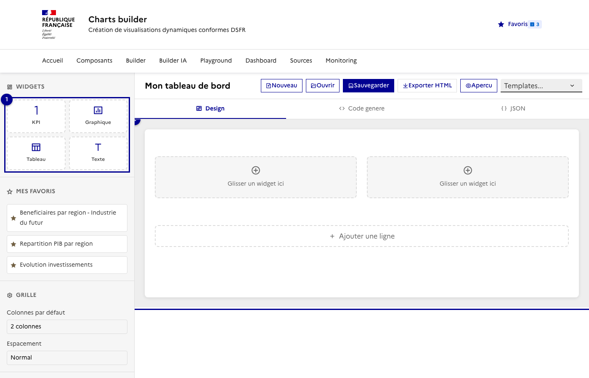

### Etape 2 — Placer des widgets

Glissez un widget depuis la bibliotheque ou un favori vers une cellule de la grille. Chaque widget peut etre configure en cliquant dessus.

La barre d'outils permet de :
- **Nouveau** / **Ouvrir** / **Sauvegarder** un dashboard
- **Exporter HTML** : telecharger le dashboard en page HTML autonome
- **Apercu** : voir le rendu final dans un navigateur


### Etape 3 — Configurer la grille

La section **Grille** dans la barre laterale permet d'ajuster :
- Le nombre de **colonnes** (1 a 4)
- L'**espacement** entre les widgets (Normal ou Sans)

Chaque ligne peut avoir un nombre de colonnes different, permettant des layouts complexes (ex: 3 KPI en ligne 1, 2 graphiques en ligne 2).

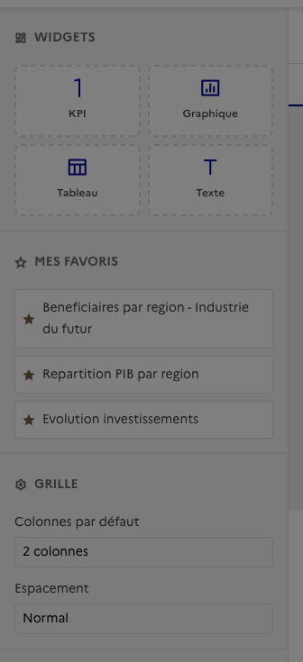

Les onglets **Code genere** et **JSON** permettent de recuperer le code HTML ou la configuration JSON du dashboard.

---

## Parcours F : Connecter une API REST externe

> **Pour** afficher des donnees issues d'une API publique (data.economie.gouv.fr, data.gouv.fr, etc.),
> **je dois** creer une connexion API dans Sources puis utiliser le Builder pour configurer le graphique,
> **afin de** creer un widget qui interroge l'API en temps reel.

### Etape 1 — Creer une connexion API

Dans **Sources**, cliquez sur **Nouvelle connexion** et selectionnez le type **API REST/JSON** :

1. Selectionnez le type **API**
2. Entrez l'**URL de l'API** (ex: `https://data.economie.gouv.fr/api/explore/v2.1/catalog/datasets/industrie-du-futur/records`)
3. Indiquez le **chemin vers les donnees** dans la reponse JSON (ex: `results` pour OpenDataSoft, `data` pour tabular-api.data.gouv.fr)
4. Cliquez sur **Tester et sauvegarder**

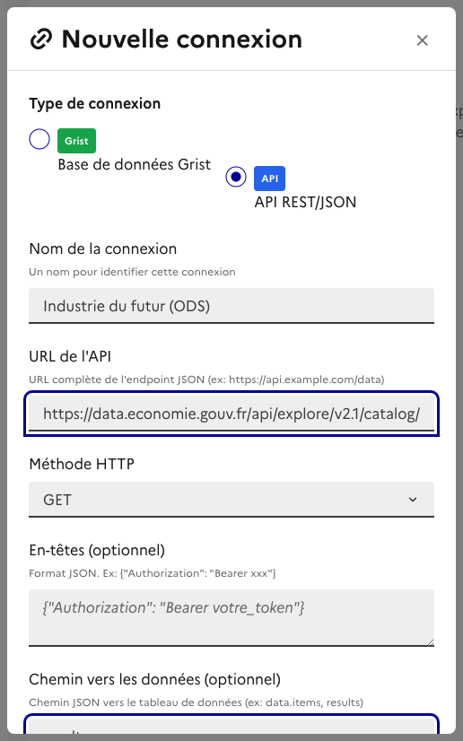

> **APIs testees** :
> - OpenDataSoft : `data.economie.gouv.fr` (chemin : `results`)
> - Tabular API : `tabular-api.data.gouv.fr` (chemin : `data`)
> - Grist API : `grist.numerique.gouv.fr` (chemin : `records[].fields`)

### Etape 2 — Generer le graphique

Dans le **Builder**, selectionnez la source API, choisissez un type de graphique et configurez les champs. Ici, un graphique en lignes des beneficiaires de l'Industrie du futur par region :

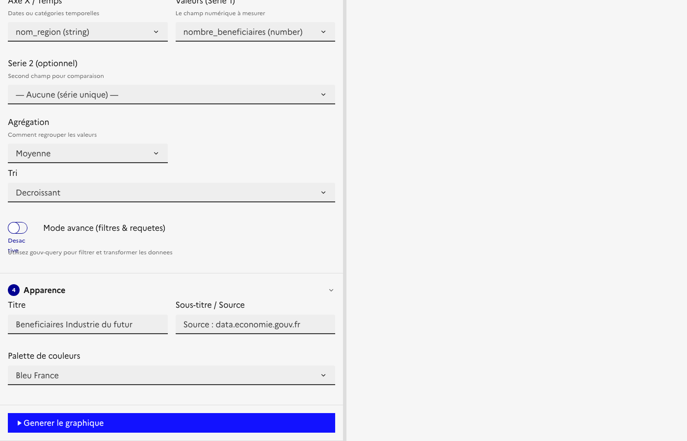

### Etape 3 — Recuperer le code

Le code genere inclut soit un fetch direct vers l'API, soit les composants `<gouv-source>` et `<gouv-dsfr-chart>` pour un chargement dynamique.

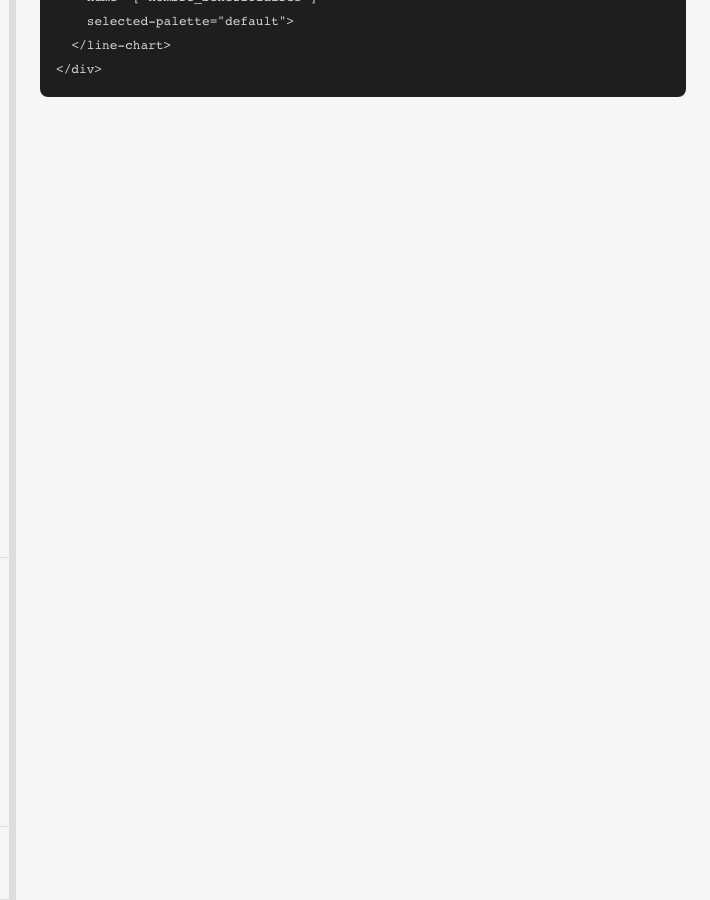

---

## Parcours G : Suivre les deployements dans le Monitoring

> **Pour** connaitre quels widgets sont deployes et sur quels sites gouvernementaux,
> **je dois** consulter la page Monitoring qui agrege les beacons envoyes par les composants,
> **afin d'** avoir une vue d'ensemble de l'utilisation en production.

### Vue d'ensemble

La page **Monitoring** affiche automatiquement les donnees collectees par le systeme de beacons. Chaque composant gouv-widgets envoie un signal au deploiement, permettant de suivre l'utilisation.

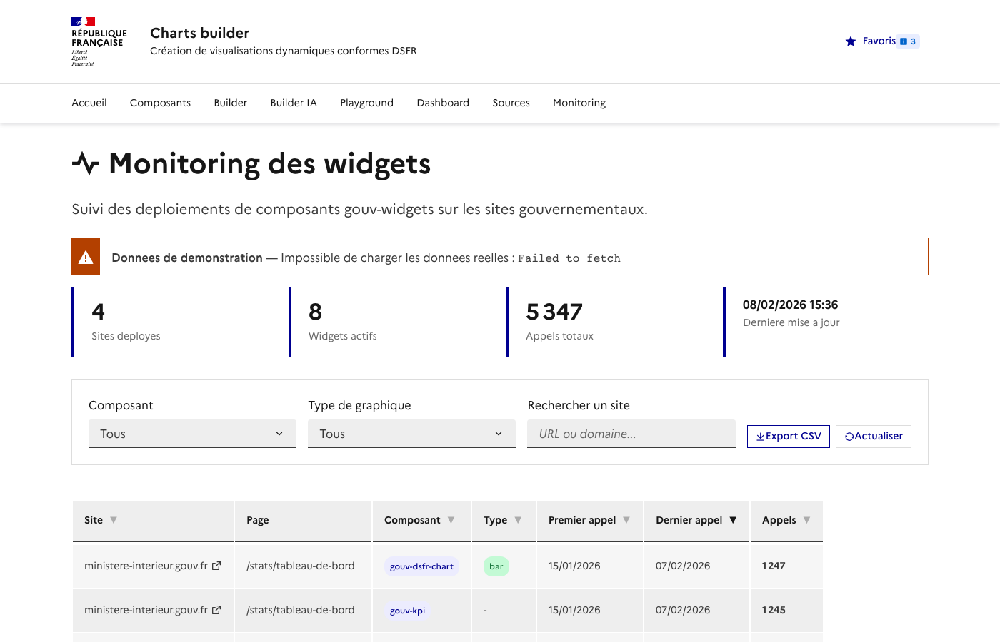

### KPIs de suivi

Quatre indicateurs en haut de page resument l'activite :
- **Sites deployes** : nombre de domaines uniques utilisant les widgets
- **Widgets actifs** : nombre total d'instances de composants
- **Appels totaux** : volume cumule de chargements de pages
- **Derniere mise a jour** : horodatage de la derniere collecte

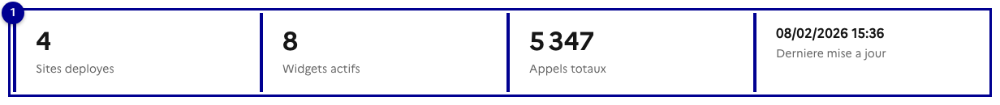

### Filtrer et exporter

Le tableau detaille liste chaque deploiement avec le site, la page, le composant utilise, le type de graphique, et les dates d'activite. Vous pouvez :
- **Filtrer** par composant ou type de graphique
- **Rechercher** un domaine specifique
- **Exporter en CSV** pour analyse
- **Actualiser** pour recharger les donnees


---

## Composants de reference

### gouv-kpi — Indicateurs chiffres

Affiche des valeurs numeriques mises en avant (chiffres cles, KPI).

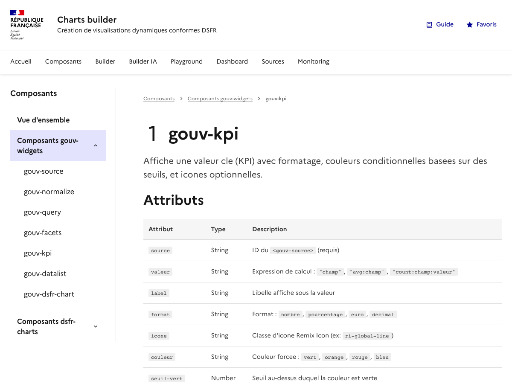

### gouv-datalist — Tableau filtrable

Tableau de donnees avec recherche, filtres par colonne, tri et export CSV.

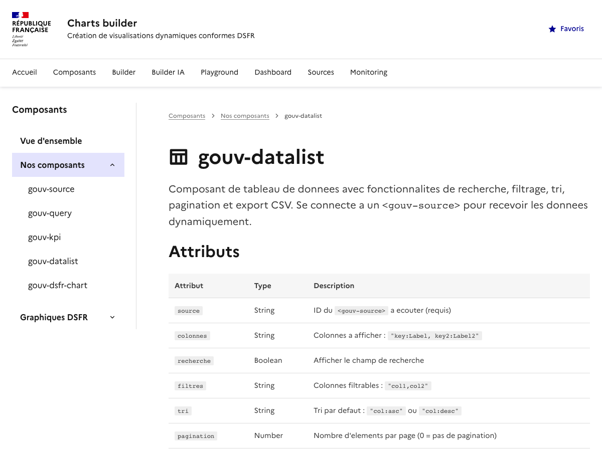

### gouv-dsfr-chart — Graphiques DSFR

Wrapper pour les graphiques DSFR natifs (barres, lignes, camembert, radar, jauge, carte, nuage de points).

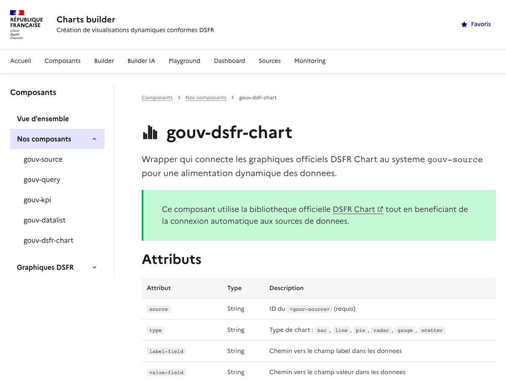

### gouv-query — Filtrage et agregation

Composant invisible de transformation de donnees : filtre, regroupe et agrege les donnees entre la source et l'affichage.

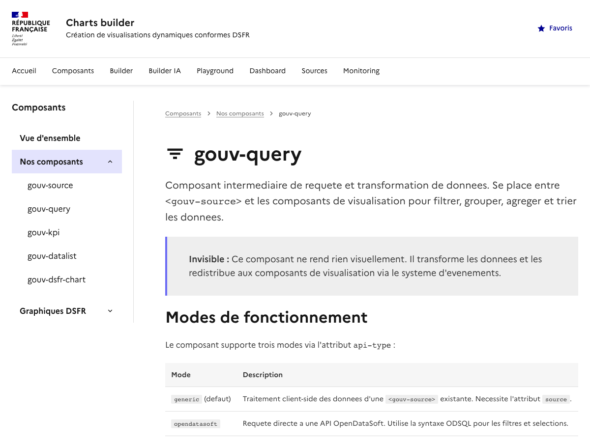

---

## Integration rapide

Le code minimal pour integrer un graphique dans votre page :

```html
<!DOCTYPE html>
<html lang="fr" data-fr-theme>
<head>
  <!-- DSFR -->
  <link rel="stylesheet" href="https://cdn.jsdelivr.net/npm/@gouvfr/dsfr@1.11.2/dist/dsfr.min.css">
  <!-- DSFR Chart -->
  <link rel="stylesheet" href="https://cdn.jsdelivr.net/npm/@gouvfr/dsfr-chart@2.0.4/dist/DSFRChart/DSFRChart.css">
  <script type="module" src="https://cdn.jsdelivr.net/npm/@gouvfr/dsfr-chart@2.0.4/dist/DSFRChart/DSFRChart.js"></script>
  <!-- gouv-widgets -->
  <script type="module" src="gouv-widgets.esm.js"></script>
</head>
<body>
  <!-- Source de donnees -->
  <gouv-source id="data"
    url="https://data.economie.gouv.fr/api/explore/v2.1/catalog/datasets/industrie-du-futur/records?limit=100"
    transform="results">
  </gouv-source>

  <!-- Filtrage et agregation -->
  <gouv-query source="data"
    group-by="nom_region"
    aggregate="nombre_beneficiaires:sum"
    order-by="value:desc"
    limit="10">
  </gouv-query>

  <!-- Graphique DSFR -->
  <gouv-dsfr-chart source="query-result"
    type="bar"
    label-field="nom_region"
    value-field="nombre_beneficiaires"
    title="Beneficiaires Industrie du futur par region"
    palette="categorical">
  </gouv-dsfr-chart>
</body>
</html>
```

Ce code :
1. Charge les donnees depuis l'API OpenDataSoft
2. Les regroupe par region avec une somme des beneficiaires
3. Affiche un graphique en barres conforme DSFR

---

## Ressources

- **Code source** : [github.com/anthropics/datasource-charts-webcomponents](https://github.com/anthropics/datasource-charts-webcomponents)
- **Demo composants** : section Composants de l'application
- **Documentation DSFR Chart** : [github.com/GouvernementFR/dsfr-chart](https://github.com/GouvernementFR/dsfr-chart)
- **API Albert** : [albert.api.etalab.gouv.fr](https://albert.api.etalab.gouv.fr)
