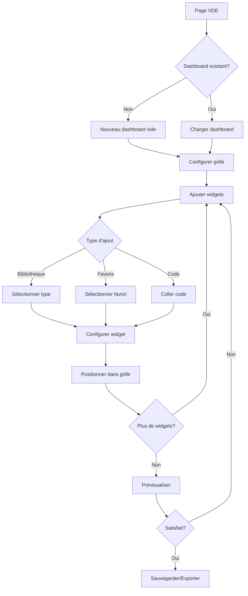

# Visual Dashboard Editor (VDE) - Étude de conception

## 1. Vision et objectifs

### Concept
Le **Visual Dashboard Editor** est un éditeur visuel permettant de composer des tableaux de bord interactifs en assemblant des widgets (graphiques, KPIs, tableaux) dans une grille configurable.

### Objectifs principaux
1. **Composer** des dashboards en glisser-déposer
2. **Réutiliser** les graphiques favoris existants
3. **Configurer** chaque widget individuellement
4. **Prévisualiser** en temps réel avec données live
5. **Exporter** le code HTML/JS autonome
6. **Sauvegarder** les dashboards comme favoris

---

## 2. Architecture proposée

### 2.1 Structure de données

```typescript
// Dashboard complet
interface Dashboard {
  id: string;                    // 'dashboard-{timestamp}'
  name: string;                  // Nom du tableau de bord
  description?: string;          // Description optionnelle
  createdAt: string;             // ISO8601
  updatedAt: string;             // ISO8601
  layout: DashboardLayout;       // Configuration de la grille
  widgets: Widget[];             // Liste des widgets
  sources: SourceReference[];    // Sources de données utilisées
  theme?: 'light' | 'dark';      // Thème (optionnel)
}

// Configuration de la grille
interface DashboardLayout {
  columns: number;               // 1-4 colonnes (défaut: 2)
  gap: 'sm' | 'md' | 'lg';       // Espacement
  responsive: boolean;           // Adaptatif mobile
}

// Widget individuel
interface Widget {
  id: string;                    // 'widget-{timestamp}'
  type: WidgetType;              // Type de widget
  title?: string;                // Titre affiché

  // Position dans la grille
  position: {
    column: number;              // 1-based
    row: number;                 // 1-based
    colSpan: number;             // Largeur en colonnes (1-4)
    rowSpan: number;             // Hauteur en lignes (1-3)
  };

  // Configuration spécifique au type
  config: WidgetConfig;

  // Source optionnelle
  source?: string;               // ID de la source

  // Origine (pour traçabilité)
  origin?: {
    type: 'favorite' | 'builder' | 'manual';
    favoriteId?: string;
  };
}

type WidgetType = 'kpi' | 'chart' | 'table' | 'text' | 'custom';

// Configurations par type
interface KPIConfig {
  valeur: string;                // Expression: 'sum:field', 'avg:field', etc.
  format: 'nombre' | 'pourcentage' | 'euro' | 'texte';
  icone?: string;                // Remix Icon class
  seuilVert?: number;
  seuilOrange?: number;
}

interface ChartConfig {
  chartType: string;             // 'bar', 'line', 'pie', etc.
  labelField: string;
  valueField: string;
  valueField2?: string;
  palette: string;
  aggregation: string;
  // ... autres options du builder
}

interface TableConfig {
  columns: string[];
  searchable: boolean;
  sortable: boolean;
  pageSize: number;
}

interface TextConfig {
  content: string;               // HTML ou Markdown
  style: 'title' | 'paragraph' | 'callout';
}

// Référence à une source de données
interface SourceReference {
  id: string;
  name: string;
  type: 'api' | 'grist' | 'manual';
  url?: string;
  refresh?: number;              // Intervalle en secondes
}
```

### 2.2 Clés de stockage localStorage

```javascript
// Dashboards sauvegardés
'gouv-widgets-dashboards'        // Dashboard[]

// Dashboard en cours d'édition (brouillon)
'gouv-widgets-dashboard-draft'   // Dashboard | null

// Historique des modifications (undo/redo)
'gouv-widgets-dashboard-history' // { past: Dashboard[], future: Dashboard[] }
```

---

## 3. Interface utilisateur

### 3.1 Layout principal

```
┌─────────────────────────────────────────────────────────────────┐
│  Header: Dashboard Builder                          [Sauvegarder] │
├──────────────┬──────────────────────────────────────────────────┤
│              │                                                   │
│   Panneau    │              Zone de prévisualisation             │
│   gauche     │              (Grille avec widgets)                │
│   (300px)    │                                                   │
│              │  ┌─────────┐ ┌─────────────────────┐             │
│  ┌─────────┐ │  │   KPI   │ │                     │             │
│  │Widgets  │ │  │  75%    │ │    Graphique        │             │
│  │Library  │ │  └─────────┘ │    (2 colonnes)     │             │
│  ├─────────┤ │  ┌─────────┐ │                     │             │
│  │ + KPI   │ │  │   KPI   │ └─────────────────────┘             │
│  │ + Chart │ │  │  120    │                                     │
│  │ + Table │ │  └─────────┘ ┌───────────────────────────────┐  │
│  │ + Text  │ │              │        Tableau de données       │  │
│  ├─────────┤ │              │        (3 colonnes)             │  │
│  │Favoris  │ │              └───────────────────────────────┘  │
│  ├─────────┤ │                                                   │
│  │ ⭐ Fav1 │ │                                                   │
│  │ ⭐ Fav2 │ │                                                   │
│  └─────────┘ │                                                   │
│              │                                                   │
│  ┌─────────┐ │                                                   │
│  │Settings │ │                                                   │
│  │ Grille  │ │                                                   │
│  │ Thème   │ │                                                   │
│  └─────────┘ │                                                   │
│              │                                                   │
├──────────────┴──────────────────────────────────────────────────┤
│  [📋 Code] [👁 Preview] [💾 Export HTML]                         │
└─────────────────────────────────────────────────────────────────┘
```

### 3.2 Panneau gauche - Widgets & Configuration

**Section 1: Bibliothèque de widgets**
- Boutons pour ajouter chaque type de widget
- Glisser-déposer vers la grille
- Icônes distinctes par type

**Section 2: Favoris disponibles**
- Liste des graphiques favoris existants
- Preview miniature au hover
- Double-clic ou glisser pour ajouter

**Section 3: Configuration**
- Paramètres de la grille (colonnes, gap)
- Nom et description du dashboard
- Options de thème

### 3.3 Zone centrale - Grille éditable

**Fonctionnalités :**
- Grille CSS Grid avec colonnes configurables
- Cellules de dépôt visuelles (zones en pointillés)
- Widgets redimensionnables (colSpan, rowSpan)
- Sélection de widget (bordure bleue)
- Bouton de configuration sur chaque widget
- Bouton de suppression sur chaque widget
- Réorganisation par glisser-déposer

**États visuels :**
- Cellule vide : fond gris pointillé + icône "+"
- Cellule avec widget : widget rendu avec overlay de contrôle
- Widget sélectionné : bordure bleue + panneau config à droite
- Drop zone active : bordure verte en pointillés

### 3.4 Panneau de configuration du widget (modal ou slide-over)

Quand un widget est sélectionné :

```
┌────────────────────────────────┐
│ Configuration du widget        │
├────────────────────────────────┤
│ Titre: [________________]      │
│                                │
│ Type: [Chart ▼]                │
│                                │
│ ─── Configuration ───          │
│ [Options spécifiques au type]  │
│ [Réutilise les forms du        │
│  builder existant]             │
│                                │
│ ─── Position ───               │
│ Colonnes: [2 ▼]  Lignes: [1 ▼] │
│                                │
│ ─── Source ───                 │
│ [Liste des sources dispo ▼]    │
│                                │
│ [Appliquer] [Supprimer widget] │
└────────────────────────────────┘
```

---

## 4. Fonctionnalités détaillées

### 4.1 Ajout de widgets

**Méthode 1: Depuis la bibliothèque**
1. Clic sur type de widget (KPI, Chart, Table, Text)
2. Widget vide ajouté à la première cellule libre
3. Modal de configuration s'ouvre automatiquement

**Méthode 2: Depuis les favoris**
1. Clic sur un favori dans la liste
2. Le widget est pré-configuré avec les paramètres du favori
3. Ajouté à la grille, prêt à l'emploi

**Méthode 3: Copier-coller de code**
1. Bouton "Widget personnalisé"
2. Zone de texte pour coller du code HTML
3. Le code est encapsulé dans un widget "custom"

**Méthode 4: Glisser-déposer**
1. Glisser un élément de la bibliothèque/favoris
2. Déposer sur une cellule vide de la grille
3. Feedback visuel pendant le drag

### 4.2 Configuration de la grille

```html
<div class="dashboard-settings">
  <label>
    Colonnes:
    <select id="grid-columns">
      <option value="1">1 colonne</option>
      <option value="2" selected>2 colonnes</option>
      <option value="3">3 colonnes</option>
      <option value="4">4 colonnes</option>
    </select>
  </label>

  <label>
    Espacement:
    <select id="grid-gap">
      <option value="sm">Petit (0.5rem)</option>
      <option value="md" selected>Moyen (1rem)</option>
      <option value="lg">Grand (1.5rem)</option>
    </select>
  </label>

  <label>
    <input type="checkbox" id="responsive" checked>
    Responsive (adaptatif mobile)
  </label>
</div>
```

### 4.3 Redimensionnement des widgets

Chaque widget peut occuper :
- **Largeur** : 1 à N colonnes (colSpan)
- **Hauteur** : 1 à 3 lignes (rowSpan)

Interface de redimensionnement :
- Poignées sur les bords du widget
- Ou sélecteur dans le panneau de configuration
- Preview en temps réel

### 4.4 Gestion des sources de données

**Sources partagées :**
- Un dashboard peut utiliser plusieurs sources
- Les sources sont déclarées une fois, réutilisées par les widgets
- Permet le rafraîchissement synchronisé

**Interface :**
```html
<div class="source-manager">
  <h4>Sources de données</h4>
  <button id="add-source">+ Ajouter une source</button>

  <div class="source-list">
    <div class="source-item">
      <span class="source-name">API Ventes</span>
      <span class="source-type">API REST</span>
      <button class="source-edit">✏️</button>
      <button class="source-delete">🗑️</button>
    </div>
  </div>
</div>
```

### 4.5 Sauvegarde et export

**Sauvegarder comme favori :**
- Bouton "Sauvegarder"
- Nom + description
- Stocké dans `gouv-widgets-dashboards`

**Exporter en HTML :**
- Génère un fichier HTML autonome
- Inclut les dépendances CDN (DSFR, DSFR Chart)
- Inclut les composants gouv-widgets
- Données embarquées ou dynamiques selon les sources

**Partager :**
- Génère une URL avec le dashboard encodé (optionnel, Phase 2)

---

## 5. Génération de code

### 5.1 Structure du code généré

```html
<!DOCTYPE html>
<html lang="fr" data-fr-theme>
<head>
  <meta charset="UTF-8">
  <meta name="viewport" content="width=device-width, initial-scale=1.0">
  <title>Mon Dashboard - gouv-widgets</title>

  <!-- DSFR -->
  <link rel="stylesheet" href="https://cdn.jsdelivr.net/npm/@gouvfr/dsfr@1.11.2/dist/dsfr.min.css">
  <link rel="stylesheet" href="https://cdn.jsdelivr.net/npm/@gouvfr/dsfr@1.11.2/dist/utility/utility.min.css">
  <link rel="stylesheet" href="https://cdn.jsdelivr.net/npm/remixicon@4.2.0/fonts/remixicon.css">

  <!-- DSFR Chart -->
  <link rel="stylesheet" href="https://cdn.jsdelivr.net/npm/@gouvfr/dsfr-chart@2.0.4/dist/DSFRChart/DSFRChart.css">
  <script type="module" src="https://cdn.jsdelivr.net/npm/@gouvfr/dsfr-chart@2.0.4/dist/DSFRChart/DSFRChart.js"></script>

  <!-- gouv-widgets -->
  <script type="module" src="https://cdn.jsdelivr.net/gh/AubertMusic/datasource-charts-webcomponents@v0.2.0/dist/gouv-widgets.esm.js"></script>

  <style>
    .dashboard-grid {
      display: grid;
      grid-template-columns: repeat(2, 1fr);
      gap: 1rem;
      padding: 1rem;
    }
    .widget { background: var(--background-default-grey); padding: 1rem; border-radius: 8px; }
    .widget-2col { grid-column: span 2; }
    .widget-2row { grid-row: span 2; }
    @media (max-width: 768px) {
      .dashboard-grid { grid-template-columns: 1fr; }
      .widget-2col { grid-column: span 1; }
    }
  </style>
</head>
<body>
  <!-- Sources de données -->
  <gouv-source id="sales-api" url="https://api.example.com/sales" refresh="60"></gouv-source>

  <div class="fr-container fr-my-4w">
    <h1>Mon Dashboard</h1>

    <div class="dashboard-grid">
      <!-- KPI -->
      <div class="widget">
        <gouv-kpi
          source="sales-api"
          valeur="sum:amount"
          label="Chiffre d'affaires"
          format="euro"
          icone="ri-money-euro-circle-line">
        </gouv-kpi>
      </div>

      <!-- Graphique sur 2 colonnes -->
      <div class="widget widget-2col">
        <h3>Évolution des ventes</h3>
        <gouv-dsfr-chart
          source="sales-api"
          type="line"
          label-field="date"
          value-field="amount"
          selected-palette="categorical">
        </gouv-dsfr-chart>
      </div>

      <!-- Tableau sur toute la largeur -->
      <div class="widget widget-2col">
        <gouv-datalist
          source="sales-api"
          columns='["date", "product", "amount", "region"]'
          searchable
          sortable>
        </gouv-datalist>
      </div>
    </div>
  </div>

  <script type="module" src="https://cdn.jsdelivr.net/npm/@gouvfr/dsfr@1.11.2/dist/dsfr.module.min.js"></script>
</body>
</html>
```

### 5.2 Classes CSS pour la grille

```css
/* Grille de base */
.dashboard-grid {
  display: grid;
  grid-template-columns: repeat(var(--cols, 2), 1fr);
  gap: var(--gap, 1rem);
}

/* Tailles de widgets */
.widget-1col { grid-column: span 1; }
.widget-2col { grid-column: span 2; }
.widget-3col { grid-column: span 3; }
.widget-4col { grid-column: span 4; }
.widget-1row { grid-row: span 1; }
.widget-2row { grid-row: span 2; }
.widget-3row { grid-row: span 3; }

/* Responsive */
@media (max-width: 992px) {
  .dashboard-grid { grid-template-columns: repeat(2, 1fr); }
  .widget-3col, .widget-4col { grid-column: span 2; }
}

@media (max-width: 576px) {
  .dashboard-grid { grid-template-columns: 1fr; }
  .widget-2col, .widget-3col, .widget-4col { grid-column: span 1; }
}
```

---

## 6. Composants à créer

### 6.1 Liste des nouveaux composants

| Composant | Description |
|-----------|-------------|
| `<app-dashboard-editor>` | Composant principal de l'éditeur |
| `<app-widget-library>` | Panneau de bibliothèque de widgets |
| `<app-widget-wrapper>` | Wrapper éditable autour d'un widget |
| `<app-grid-editor>` | Zone de grille avec drag-and-drop |
| `<app-widget-config>` | Panneau de configuration modal |
| `<app-dashboard-preview>` | Preview responsive du dashboard |

### 6.2 Réutilisation de composants existants

- `<app-layout-builder>` : Layout split avec resizer
- `<app-preview-panel>` : Onglets Preview/Code/Data
- Forms de configuration du builder existant
- `<gouv-source>`, `<gouv-kpi>`, `<gouv-dsfr-chart>`, `<gouv-datalist>`

---

## 7. Flux utilisateur

### 7.1 Création d'un nouveau dashboard



### 7.2 Import depuis les favoris

1. Ouvrir la section "Favoris" dans le panneau gauche
2. Les favoris existants sont listés avec miniatures
3. Clic sur un favori → Modal de configuration pré-remplie
4. "Ajouter au dashboard" → Widget placé dans la grille
5. Le widget conserve le lien vers le favori d'origine

---

## 8. Roadmap d'implémentation

### Phase 1 : MVP (2-3 semaines)

**Semaine 1 :**
- [ ] Créer la page `dashboard.html` avec layout de base
- [ ] Implémenter la grille éditable (CSS Grid + JS)
- [ ] Ajouter des widgets vides (KPI, Chart, Table)
- [ ] Configurer le nombre de colonnes

**Semaine 2 :**
- [ ] Intégrer les forms de configuration du builder
- [ ] Connecter aux favoris existants
- [ ] Implémenter le redimensionnement (colSpan/rowSpan)
- [ ] Sauvegarde dans localStorage

**Semaine 3 :**
- [ ] Génération de code HTML autonome
- [ ] Preview responsive
- [ ] Export fichier HTML
- [ ] Tests et polish

### Phase 2 : Améliorations (post-MVP)

- [ ] Drag-and-drop fluide avec bibliothèque (Sortable.js)
- [ ] Templates de dashboards pré-définis
- [ ] Undo/Redo
- [ ] Thèmes (clair/sombre)
- [ ] Import/Export JSON
- [ ] Duplication de widgets

### Phase 3 : Fonctionnalités avancées

- [ ] Mode présentation plein écran
- [ ] Partage via URL
- [ ] Filtres globaux inter-widgets
- [ ] Widgets personnalisés (iframe, code custom)
- [ ] Collaboration temps réel (optionnel)

---

## 9. Considérations techniques

### 9.1 Performances

- Lazy loading des widgets non visibles
- Debounce sur les mises à jour de configuration
- Cache des données sources partagées
- Virtualisation pour grilles très grandes

### 9.2 Accessibilité

- Navigation clavier dans la grille
- Labels ARIA pour les zones de dépôt
- Annonces vocales lors des actions
- Respect des contrastes DSFR

### 9.3 Responsive

- Grille s'adapte automatiquement
- Widgets passent en empilé sur mobile
- Mode édition optimisé desktop
- Preview disponible sur mobile

### 9.4 Sécurité

- Sanitization du code custom collé
- CSP compatible avec les CDN utilisés
- Pas d'exécution de JS arbitraire

---

## 10. Mockups et wireframes

### 10.1 Vue principale de l'éditeur

```
┌──────────────────────────────────────────────────────────────────────┐
│ 📊 Visual Dashboard Editor                    [Nouveau] [Mes dashboards] │
├────────────────────────────────────────────────────────────────────────┤
│                                                                        │
│ ┌──────────────┬───────────────────────────────────────────────────┐  │
│ │              │                                                    │  │
│ │ 📦 Widgets   │   ┌─────────┐ ┌─────────┐ ┌─────────────────────┐ │  │
│ │              │   │         │ │         │ │                     │ │  │
│ │ [+ KPI    ]  │   │  KPI 1  │ │  KPI 2  │ │     Graphique       │ │  │
│ │ [+ Chart  ]  │   │  85%    │ │  1,234  │ │     barres          │ │  │
│ │ [+ Table  ]  │   │         │ │         │ │                     │ │  │
│ │ [+ Texte  ]  │   └─────────┘ └─────────┘ └─────────────────────┘ │  │
│ │              │                                                    │  │
│ │ ⭐ Favoris   │   ┌─────────────────────────────────────────────┐ │  │
│ │              │   │                                              │ │  │
│ │ • Ventes Q1  │   │            Tableau de données               │ │  │
│ │ • Score RGAA │   │            (toute la largeur)               │ │  │
│ │ • Evolution  │   │                                              │ │  │
│ │              │   └─────────────────────────────────────────────┘ │  │
│ │ ⚙️ Réglages  │                                                    │  │
│ │              │   ┌ ─ ─ ─ ─ ─ ─ ─ ─ ─ ─ ─ ─ ─ ─ ─ ─ ─ ─ ─ ─ ─ ┐ │  │
│ │ Colonnes: 3  │       + Glisser un widget ici                    │  │
│ │ Gap: Moyen   │   └ ─ ─ ─ ─ ─ ─ ─ ─ ─ ─ ─ ─ ─ ─ ─ ─ ─ ─ ─ ─ ─ ┘ │  │
│ │              │                                                    │  │
│ └──────────────┴───────────────────────────────────────────────────┘  │
│                                                                        │
│ [👁 Preview] [📋 Code généré] [💾 Sauvegarder] [📤 Exporter HTML]    │
└────────────────────────────────────────────────────────────────────────┘
```

### 10.2 Widget en mode édition

```
┌─────────────────────────────────────┐
│ 📊 Évolution des ventes     [⚙][×] │  ← Titre + boutons config/supprimer
├─────────────────────────────────────┤
│                                     │
│         [Graphique affiché]         │
│                                     │
│                                     │
├───────────────────────────────[↔]───┤  ← Poignée de redimensionnement
│ [⬅️ 2 cols] [⬆️ 1 ligne]            │  ← Indicateurs de taille
└─────────────────────────────────────┘
```

---

## 11. Questions ouvertes

1. **Glisser-déposer** : Utiliser une bibliothèque (Sortable.js, dnd-kit) ou implémentation native ?
2. **Positionnement** : Grille stricte (row/col fixes) ou flow automatique ?
3. **Thèmes** : Supporter le mode sombre DSFR dès le MVP ?
4. **Templates** : Inclure des templates pré-définis au lancement ?
5. **Taille maximale** : Limiter le nombre de widgets par dashboard ?

---

## 12. Annexes

### A. Comparaison avec outils existants

| Fonctionnalité | Metabase | Superset | VDE (proposé) |
|----------------|----------|----------|---------------|
| Grille flexible | ✅ | ✅ | ✅ |
| Drag-and-drop | ✅ | ✅ | ✅ |
| Sources multiples | ✅ | ✅ | ✅ |
| Export HTML | ❌ | ❌ | ✅ |
| Composants Web | ❌ | ❌ | ✅ |
| Conformité DSFR | ❌ | ❌ | ✅ |
| Auto-hébergé | ✅ | ✅ | ✅ |
| Sans backend | ❌ | ❌ | ✅ |

### B. Technologies recommandées

- **Drag-and-drop** : Sortable.js (léger, accessible) ou native HTML5 DnD
- **Grille** : CSS Grid natif (pas de framework CSS supplémentaire)
- **État** : Pattern state object existant (cohérence avec builder)
- **Stockage** : localStorage (cohérence avec favoris existants)

---

*Document créé le 2025-02-07*
*Version 1.0 - Étude de conception initiale*
