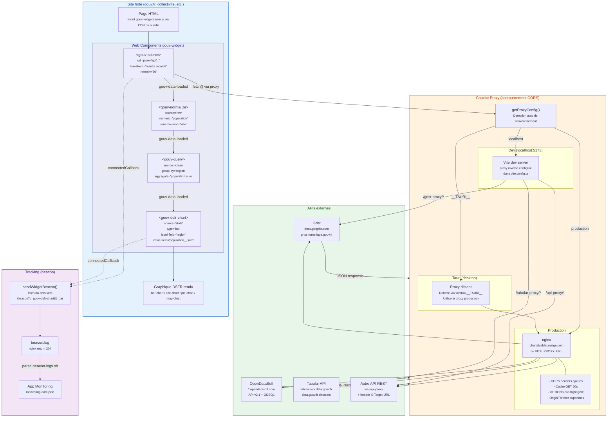
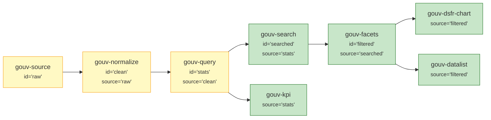

# Diagrammes d'architecture -- gouv-widgets

## 1. Fonctionnement d'un graphique dynamique (avec API)

Ce diagramme montre le parcours complet des donnees depuis l'API externe jusqu'au graphique rendu sur le site hote, en passant par la couche proxy.



---

## 2. Chainages des composants gouv-*

Ce diagramme montre comment les differents composants s'enchainent, leur role, et les mecanismes de communication (events, data-bridge, commands).

```mermaid
flowchart TB
    subgraph LEGENDE["Legende"]
        direction LR
        L_INVIS["Composant invisible<br/>(pas de rendu DOM)"]
        L_VISU["Composant visuel<br/>(rendu DSFR)"]
        L_EVENT["--- evenement data-bridge"]
        L_CMD["-.- commande upstream"]
        style L_INVIS fill:#fff9c4,stroke:#f9a825
        style L_VISU fill:#c8e6c9,stroke:#2e7d32
    end

    subgraph DATA_BRIDGE["data-bridge.ts -- Bus d'evenements"]
        direction LR
        CACHE["dataCache<br/><small>Map&lt;sourceId, data[]&gt;</small>"]
        META["metaCache<br/><small>Map&lt;sourceId, {page, total, pageSize}&gt;</small>"]
        EVENTS["CustomEvents sur document<br/><small>gouv-data-loaded<br/>gouv-data-loading<br/>gouv-data-error<br/>gouv-source-command</small>"]
    end

    subgraph PIPELINE["Pipeline de donnees"]
        direction TB

        subgraph SOURCES["Etape 1 : Acquisition"]
            direction TB
            SRC["gouv-source<br/><small>Composant invisible</small>"]
            SRC_DETAIL["<small>- Fetch HTTP (GET/POST)<br/>- Headers + auth<br/>- Pagination serveur (paginate)<br/>- JSON path (transform)<br/>- Auto-refresh (refresh)<br/>- Cache data-bridge</small>"]
            SRC --- SRC_DETAIL
        end

        subgraph NORMALISATION["Etape 2 : Normalisation"]
            direction TB
            NORM["gouv-normalize<br/><small>Composant invisible</small>"]
            NORM_DETAIL["<small>- flatten (objets imbriques)<br/>- numeric / numeric-auto<br/>- rename (champ:NouveauNom)<br/>- trim, strip-html<br/>- lowercase-keys<br/>- replace</small>"]
            NORM --- NORM_DETAIL
        end

        subgraph REQUETAGE["Etape 3 : Requetage / Aggregation"]
            direction TB
            QUERY["gouv-query<br/><small>Composant invisible</small>"]
            QUERY_DETAIL["<small>- filter (champ:operateur:valeur)<br/>- group-by + aggregate<br/>- order-by, limit<br/>- Mode serveur (server-side)<br/>- 3 adapters : Generic, ODS, Tabular</small>"]
            QUERY --- QUERY_DETAIL

            subgraph ADAPTERS["Adapters API"]
                direction LR
                GENERIC["GenericAdapter<br/><small>Client-side<br/>Pas de fetch</small>"]
                ODS_A["OpenDataSoftAdapter<br/><small>ODSQL natif<br/>Facets serveur<br/>Pagination serveur</small>"]
                TAB_A["TabularAdapter<br/><small>data.gouv.fr<br/>Fetch serveur<br/>Pas de facets serveur</small>"]
            end
            QUERY --> ADAPTERS
        end

        subgraph FILTRAGE["Etape 4 : Filtres interactifs (optionnel)"]
            direction TB
            SEARCH["gouv-search<br/><small>Composant VISUEL</small>"]
            SEARCH_DETAIL["<small>- Barre de recherche DSFR<br/>- Modes : contains, starts, words<br/>- Client ou server-search<br/>- Debounce configurable<br/>- URL sync<br/>- Compteur de resultats</small>"]
            SEARCH --- SEARCH_DETAIL

            FACETS["gouv-facets<br/><small>Composant VISUEL</small>"]
            FACETS_DETAIL["<small>- Filtres a facettes (checkboxes)<br/>- Client ou server-facets<br/>- Disjonctif (OR) / conjonctif (AND)<br/>- Tri : count, alpha<br/>- Max valeurs + 'voir plus'<br/>- URL sync</small>"]
            FACETS --- FACETS_DETAIL
        end

        subgraph AFFICHAGE["Etape 5 : Rendu"]
            direction TB
            DISPLAY["gouv-display<br/><small>Composant VISUEL</small>"]
            DISPLAY_DETAIL["<small>- Template HTML ({{field}})<br/>- Grille CSS 1-6 colonnes<br/>- Pagination client/serveur<br/>- Message vide</small>"]
            DISPLAY --- DISPLAY_DETAIL

            DATALIST["gouv-datalist<br/><small>Composant VISUEL</small>"]
            DATALIST_DETAIL["<small>- Tableau de donnees DSFR<br/>- Tri par colonne<br/>- Export CSV/HTML<br/>- Pagination</small>"]
            DATALIST --- DATALIST_DETAIL

            KPI["gouv-kpi<br/><small>Composant VISUEL</small>"]
            KPI_DETAIL["<small>- Indicateur chiffre cle<br/>- Agregation (avg, sum, count)<br/>- Format (nombre, %, euro)<br/>- Seuils couleur<br/>- Tendance (up/down)</small>"]
            KPI --- KPI_DETAIL

            DSFR_CHART["gouv-dsfr-chart<br/><small>Composant VISUEL</small>"]
            DSFR_DETAIL["<small>- Wrapper DSFR Chart (Vue)<br/>- Types : line, bar, pie, radar,<br/>  gauge, scatter, bar-line,<br/>  map, map-reg<br/>- Palette DSFR<br/>- Attributs differes (setTimeout 500ms)</small>"]
            DSFR_CHART --- DSFR_DETAIL
        end
    end

    %% Flux de donnees (evenements)
    SRC ==>|"gouv-data-loaded<br/>{sourceId, data}"| NORM
    NORM ==>|"gouv-data-loaded<br/>{sourceId, data}"| QUERY
    QUERY ==>|"gouv-data-loaded<br/>{sourceId, data}"| SEARCH
    SEARCH ==>|"gouv-data-loaded<br/>{sourceId, data}"| FACETS
    FACETS ==>|"gouv-data-loaded"| DISPLAY
    FACETS ==>|"gouv-data-loaded"| DATALIST
    FACETS ==>|"gouv-data-loaded"| KPI
    FACETS ==>|"gouv-data-loaded"| DSFR_CHART

    %% Raccourcis possibles (sans search/facets)
    QUERY -.->|"raccourci<br/>sans filtres"| DISPLAY
    QUERY -.->|"raccourci"| DATALIST
    QUERY -.->|"raccourci"| KPI
    QUERY -.->|"raccourci"| DSFR_CHART

    %% Commandes upstream (server-side)
    DISPLAY -.->|"gouv-source-command<br/>{page: N}"| QUERY
    DATALIST -.->|"gouv-source-command<br/>{orderBy: ...}"| QUERY
    SEARCH -.->|"gouv-source-command<br/>{where: 'search(...)'}"| QUERY
    FACETS -.->|"gouv-source-command<br/>{where: 'field=val'}"| QUERY

    %% Mixin
    MIXIN["SourceSubscriberMixin<br/><small>Mixin Lit partage par tous les<br/>composants consommateurs.<br/>Gere l'abonnement, le cache,<br/>et le lifecycle.</small>"]
    MIXIN -.-> NORM
    MIXIN -.-> QUERY
    MIXIN -.-> SEARCH
    MIXIN -.-> FACETS
    MIXIN -.-> DISPLAY
    MIXIN -.-> DATALIST
    MIXIN -.-> KPI
    MIXIN -.-> DSFR_CHART

    %% Styles
    classDef invisible fill:#fff9c4,stroke:#f9a825,color:#4a4a00
    classDef visual fill:#c8e6c9,stroke:#2e7d32,color:#1b5e20
    classDef bridge fill:#e3f2fd,stroke:#1565c0,color:#0d47a1
    classDef adapter fill:#f3e5f5,stroke:#6a1b9a,color:#4a148c
    classDef mixin fill:#fce4ec,stroke:#c62828,color:#b71c1c

    class SRC,NORM,QUERY invisible
    class SEARCH,FACETS,DISPLAY,DATALIST,KPI,DSFR_CHART visual
    class DATA_BRIDGE,CACHE,META,EVENTS bridge
    class GENERIC,ODS_A,TAB_A adapter
    class MIXIN mixin
```



---

## 3. Exemple concret : pipeline complet en HTML

Voici comment les composants se chainent dans une page reelle :

```html
<!-- Etape 1 : Charger les donnees depuis OpenDataSoft -->
<gouv-source id="raw"
  url="https://proxy/api-proxy/data.opendatasoft.com/api/explore/v2.1/catalog/datasets/communes/records"
  transform="results" />

<!-- Etape 2 : Nettoyer les donnees -->
<gouv-normalize id="clean" source="raw"
  numeric="population"
  rename="nom_commune:Commune | code_region:Region"
  trim />

<!-- Etape 3 : Agreger par region -->
<gouv-query id="stats" source="clean"
  group-by="Region"
  aggregate="population:sum"
  order-by="population__sum:desc"
  limit="10" />

<!-- Etape 4a : Recherche textuelle -->
<gouv-search id="searched" source="stats" fields="Region" />

<!-- Etape 4b : Filtres a facettes -->
<gouv-facets id="filtered" source="searched" fields="Region" />

<!-- Etape 5 : Affichage -->
<gouv-dsfr-chart source="filtered"
  type="bar"
  label-field="Region"
  value-field="population__sum"
  palette="green" />

<!-- Ou en parallele, d'autres vues sur les memes donnees -->
<gouv-kpi source="stats"
  valeur="sum:population__sum"
  label="Population totale"
  format="nombre" />

<gouv-datalist source="filtered"
  columns="Region, population__sum:Population"
  pagination="5" />
```


